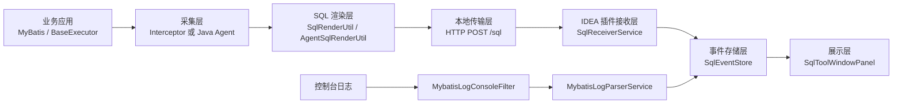

# Code Read

这份文档不是需求文档，而是“照着当前仓库源码来解释它到底怎么工作”的代码阅读说明。重点是把真实实现讲清楚，而不是描述未来规划。

## 1. 项目定位

这个仓库的本质是一个本地观测工具，核心目标只有一句话：

把业务应用执行出来的 MyBatis SQL 和耗时，送回 IntelliJ IDEA 插件里展示。

为了实现这件事，作者把系统拆成了三个进程侧角色：
- 业务应用进程
- IntelliJ IDEA 插件进程
- 开发者自己打开的 Demo / 测试工程

在代码层面，它又被拆成三个 Gradle 模块：
- `mybatis-time-cost-idea`
- `mybatis-time-cost-mybatis`
- `mybatis-time-cost-demo`

还要注意一点：`mybatis-time-cost-idea` 模块内部又内嵌了一个 `agent` 子模块，它不是独立插件，而是会被打进插件 ZIP 的 Java Agent。

## 2. 总体架构

可以把当前实现抽象成下面这张图：

图里有两个入口：
- 入口 A：业务应用直接通过 MyBatis 拦截器或 Java Agent 上报结构化事件
- 入口 H：IDEA 控制台输出的 MyBatis 日志被插件解析后，转换成事件

两个入口最终都会汇总到 `SqlEventStore`，所以 Tool Window 只关心“事件已经进来了”，不关心它最初来自哪条采集链路。

## 3. 模块拆解

### 3.1 `mybatis-time-cost-idea`

这是 IntelliJ IDEA 插件本体，职责可以拆成 6 块：

1. 插件声明与扩展注册
2. 配置持久化
3. 本地 HTTP 接收
4. 事件存储与广播
5. Tool Window 展示
6. 集成 Run/Debug 与 Console

### 3.2 `mybatis-time-cost-idea/agent`

这是随插件一起分发的 Java Agent，作用是：
- 当用户直接从 IDEA 启动 Java 程序时
- 插件自动把 `-javaagent:...` 注入 JVM 参数
- Agent 在目标 JVM 中织入 MyBatis 执行器
- 采集到 SQL 后回传给本地 IDEA 插件

换句话说，这个 `agent` 是“插件给业务应用加的 runtime 采集器”。

### 3.3 `mybatis-time-cost-mybatis`

这是一个更传统的接入方式：
- 业务系统自己引入这个 jar
- 手动把 `TimeCostInterceptor` 注册到 MyBatis
- 由拦截器采集和发送 SQL 事件

它不依赖 IDEA API，所以可以单独发布、单独被业务工程消费。

### 3.4 `mybatis-time-cost-demo`

这是一个验证链路用的演示项目，不承担框架职责。它的意义主要在于：
- 验证 `mybatis-time-cost-mybatis` 是否工作
- 验证 HTTP 上报能否被 IDEA 插件收到
- 降低第一次联调的门槛

## 4. IDEA 插件如何被加载

入口从 [plugin.xml](/Users/wintermist/IdeaProjects/mybatis_time_cost/mybatis-time-cost-idea/src/main/resources/META-INF/plugin.xml) 开始。

当前注册了这些扩展点和服务：
- `applicationConfigurable`
  - 对应 `SqlSettingsConfigurable`
  - 提供设置页
- `runConfigurationExtension`
  - 对应 `MybatisAgentRunConfigurationExtension`
  - 在 Run/Debug 时注入 Java Agent
- `applicationService`
  - `SqlEventStore`
  - `MybatisLogParserService`
  - `SqlSettingsState`
  - `SqlReceiverService`
- `consoleFilterProvider`
  - 对应 `MybatisConsoleFilterProvider`
  - 给控制台挂日志解析器
- `toolWindow`
  - 对应 `SqlToolWindowFactory`
  - 创建底部 Tool Window

从这个文件就能直接看出插件的大致架构：它不是一个单纯 UI 插件，而是“服务 + 接收 + 解析 + 展示”一起工作的插件。

## 5. 配置系统

配置核心类是 [SqlSettingsState.java](/Users/wintermist/IdeaProjects/mybatis_time_cost/mybatis-time-cost-idea/src/main/java/com/mybatis/timecost/idea/SqlSettingsState.java)。

它实现了 `PersistentStateComponent`，所以 IDEA 会自动把它的状态持久化到：
- `mybatis-time-cost.xml`

当前保存的主要字段有：
- `captureEnabled`
- `logCaptureEnabled`
- `httpCaptureEnabled`
- `agentInjectionEnabled`
- `port`
- `maxEvents`
- `autoCopyToClipboard`
- `slowThresholdMs`

这里有两个设计点值得注意。

### 5.1 设置页值不一定等于运行时值

`getPort()` 并不是直接返回持久化配置，而是有覆盖优先级：

1. JVM 参数 `mybatis.timecost.port`
2. 环境变量 `MYBATIS_TIME_COST_PORT`
3. 配置文件中的 `state.port`

这说明作者在设计时明确考虑了“外部环境临时覆盖”的场景。

### 5.2 设置变化不是被动轮询，而是主动广播

`SqlSettingsState` 内部维护了 `listeners`，并提供：
- `addListener`
- `removeListener`
- `notifySettingsChanged`

UI 和服务层会订阅这个变化，而不是反复轮询。这个设计让配置变化传播路径比较干净。

## 6. 本地 HTTP 接收层

接收入口是 [SqlReceiverService.java](/Users/wintermist/IdeaProjects/mybatis_time_cost/mybatis-time-cost-idea/src/main/java/com/mybatis/timecost/idea/SqlReceiverService.java)。

这是整个插件最关键的服务之一，因为无论是：
- MyBatis 拦截器链路
- Java Agent 链路

最终都会把事件 POST 到这里。

### 6.1 生命周期

`SqlReceiverService` 是 application service，并且在 `plugin.xml` 里加了 `preload="true"`。

这表示：
- IDEA 启动插件后会尽早创建这个服务
- 构造函数里会直接调用 `reloadConfiguration()`
- 如果设置允许 HTTP 接收，就会立刻启动本地服务

所以用户不需要先打开 Tool Window，HTTP 服务也会起来。

### 6.2 启动逻辑

`reloadConfiguration()` 的逻辑大致是：

1. 读取 `SqlSettingsState`
2. 如果总开关关闭或者 HTTP 接收关闭，直接停服务
3. 如果服务已经启动且端口没变，就不重复启动
4. 否则停掉旧服务，重新绑定端口

这里还做了端口占用处理：
- 如果当前端口被占用
- 并且端口不是通过外部环境强制覆盖的
- 会尝试从 `port + 1` 到 `port + 20` 之间找一个可用端口
- 找到后回写到设置，并广播配置变更

这属于比较实用的容错设计。

### 6.3 协议格式

当前 `/sql` 接口接收的是一个非常轻量的 JSON：
- `sqlRendered` 或 `sql`
- `durationMs`
- `mapperId`
- `threadName`

注意：业务侧发送的数据可能比这更多，比如 `mybatis-time-cost-mybatis` 会发送 `sqlTemplate`、`startedAt`、`endedAt`、`timing`，但插件当前实际只消费了最关键的几项。

这说明当前事件模型是“发送端 richer，接收端 simpler”。

### 6.4 收到事件后做了什么

`SqlHandler.handle()` 收到请求后，核心动作有 4 个：

1. 反序列化 JSON
2. 校验 `sql` 是否存在
3. 写一条 IDEA 日志
4. 创建 `SqlEvent` 并塞进 `SqlEventStore`

如果开启了自动复制，还会把 SQL 放进剪贴板。

### 6.5 为什么这里要写日志

这一点很有意思。插件接收到 HTTP 事件后，不只是更新 UI，还会写一条形如：

`[MyBatis-TimeCost] duration=... mapper=... thread=... sql=...`

这带来两个效果：
- 开发者可以在 `idea.log` 里直接看到事件
- 即使 Tool Window 没开，也能通过日志追踪采集是否工作

## 7. 事件存储层

事件存储由 [SqlEventStore.java](/Users/wintermist/IdeaProjects/mybatis_time_cost/mybatis-time-cost-idea/src/main/java/com/mybatis/timecost/idea/SqlEventStore.java) 负责。

### 7.1 存储模型非常简单

当前事件对象是 [SqlEvent.java](/Users/wintermist/IdeaProjects/mybatis_time_cost/mybatis-time-cost-idea/src/main/java/com/mybatis/timecost/idea/SqlEvent.java)。

字段只有：
- `receivedAt`
- `sql`
- `durationMs`
- `mapperId`
- `threadName`

这说明当前 UI 层只需要“最小可展示模型”，还没有演化到完整的执行记录模型。

### 7.2 为什么没有直接用消息总线

`SqlEventStore` 采用的是非常直接的内存方案：
- `List<SqlEvent> events`
- `CopyOnWriteArrayList<SqlEventListener> listeners`

新增事件时：
1. 先加到头部
2. 按 `maxEvents` 做裁剪
3. 遍历 listener 逐个通知

这种方式的优点是：
- 简单
- 好懂
- 适合当前“单机、小规模、只在插件内使用”的场景

缺点也明显：
- 事件模型比较薄
- 没有分类索引
- 没有分页
- 没有持久化历史

但对当前阶段来说，这是合理的。

## 8. Tool Window 展示层

UI 入口是 [SqlToolWindowFactory.java](/Users/wintermist/IdeaProjects/mybatis_time_cost/mybatis-time-cost-idea/src/main/java/com/mybatis/timecost/idea/SqlToolWindowFactory.java)，实际界面是 [SqlToolWindowPanel.java](/Users/wintermist/IdeaProjects/mybatis_time_cost/mybatis-time-cost-idea/src/main/java/com/mybatis/timecost/idea/SqlToolWindowPanel.java)。

### 8.1 布局结构

`SqlToolWindowPanel` 本质上是一个两栏布局：
- 上方工具栏
- 中间 `OnePixelSplitter`

Splitter 左侧是事件表格：
- 时间
- 耗时
- Mapper
- SQL 预览

右侧是详情文本框，展示：
- 时间
- Duration
- Mapper
- Thread
- 完整 SQL

### 8.2 UI 和数据是怎么绑定的

构造函数里做了 4 件事：

1. `buildUi()`
2. `loadExistingEvents()`
3. 向 `SqlEventStore` 注册监听
4. 向 `SqlSettingsState` 注册监听

这意味着：
- UI 初始化时会先加载已有事件
- 后续收到新事件会立即刷新
- 设置变化也会立即刷新状态栏

### 8.3 线程切换

`onSqlEvent()` 里用了：
- `ApplicationManager.getApplication().invokeLater(...)`

这是必要的，因为 HTTP 接收线程和控制台过滤线程都不是 Swing UI 线程。UI 更新必须切回 IDEA 应用线程。

### 8.4 慢 SQL 高亮

表格 renderer 会读取 `slowThresholdMs`，如果事件耗时超过阈值，就把文本颜色设为 `JBColor.RED`。

这是一个很轻量但有效的交互设计：
- 不需要额外列
- 不需要图标
- 直接靠颜色表达“这条要关注”

### 8.5 工具栏动作

当前工具栏包含：
- 启用采集
- 复制 SQL
- 清空
- 打开设置

其中“启用采集”不仅影响 UI 状态，还会触发：
- 改写 `SqlSettingsState`
- 重载 `SqlReceiverService`
- 广播配置变更

所以它不是“纯前端开关”，而是直接驱动服务层状态。

## 9. 设置页

设置页实现类是 [SqlSettingsConfigurable.java](/Users/wintermist/IdeaProjects/mybatis_time_cost/mybatis-time-cost-idea/src/main/java/com/mybatis/timecost/idea/SqlSettingsConfigurable.java)。

它做的事情很标准，但里面能看出当前版本的能力边界。

当前页上暴露的选项有：
- 启用 SQL 采集
- Run/Debug 自动注入 Java Agent
- 启用控制台日志解析
- 启用本地 HTTP 接收
- 自动复制 SQL 到剪贴板
- 监听端口
- 最大事件数
- 慢查询阈值

这几个选项正好对应了当前代码里已经真正实现的能力，没有夸大未来功能。

## 10. 控制台日志解析链路

日志解析由三个类组成：
- [MybatisConsoleFilterProvider.java](/Users/wintermist/IdeaProjects/mybatis_time_cost/mybatis-time-cost-idea/src/main/java/com/mybatis/timecost/idea/MybatisConsoleFilterProvider.java)
- [MybatisLogConsoleFilter.java](/Users/wintermist/IdeaProjects/mybatis_time_cost/mybatis-time-cost-idea/src/main/java/com/mybatis/timecost/idea/MybatisLogConsoleFilter.java)
- [MybatisLogParserService.java](/Users/wintermist/IdeaProjects/mybatis_time_cost/mybatis-time-cost-idea/src/main/java/com/mybatis/timecost/idea/MybatisLogParserService.java)

### 10.1 工作方式

流程是：

1. IDEA 控制台输出一行日志
2. `MybatisLogConsoleFilter.applyFilter()` 收到这一行
3. 它把原始行交给 `MybatisLogParserService.acceptLine()`
4. 解析成功则组装 `SqlEvent`
5. 放入 `SqlEventStore`

### 10.2 解析策略

`MybatisLogParserService` 不是对任意日志做全文分析，而是专门针对一类结构：
- 外层日志格式：`[timestamp] [thread] [mapper] : payload`
- 内层 MyBatis 语义行：
  - `==> Preparing: ...`
  - `==> Parameters: ...`
  - `<== Total: ...`

内部通过 `pendingSqlMap` 做三段式拼装：
- 遇到 `Preparing`，先缓存模板 SQL
- 遇到 `Parameters`，补全参数列表
- 遇到 `Total`，计算耗时并生成最终事件

键值使用：
- `threadName + "|" + mapper`

这说明作者假设：
- 同一个线程内
- 同一个 mapper
- Preparing / Parameters / Total 三行会按顺序抵达

这个假设在大多数开发调试日志里通常是成立的。

### 10.3 参数还原方式

日志链路里参数已经不是结构化对象，而是纯文本。`MybatisLogParserService` 通过：
- 逗号拆分
- 括号识别类型
- 简单类型判断

把参数替换回 SQL 模板。

这个方案比拦截器链路弱，因为：
- 它依赖日志格式稳定
- 只能做字符串级推断
- 复杂对象、集合、特殊类型容易有边界情况

但它的优点是接入成本低。

## 11. Run/Debug 自动注入 Agent 的链路

这个能力由 [MybatisAgentRunConfigurationExtension.java](/Users/wintermist/IdeaProjects/mybatis_time_cost/mybatis-time-cost-idea/src/main/java/com/mybatis/timecost/idea/MybatisAgentRunConfigurationExtension.java) 实现。

### 11.1 作用

当用户从 IDEA 启动一个 Java 运行配置时，扩展会检查：
- 是否启用总开关
- 是否启用 agentInjection
- 当前运行配置是不是 Java 相关配置

满足条件后，就往 JVM 参数里加：

`-javaagent:/path/to/mybatis-time-cost-javaagent-0.1.0.jar=host=127.0.0.1,port=xxxx`

### 11.2 Agent 包是怎么定位的

[AgentArtifactLocator.java](/Users/wintermist/IdeaProjects/mybatis_time_cost/mybatis-time-cost-idea/src/main/java/com/mybatis/timecost/idea/AgentArtifactLocator.java) 会从当前插件 jar 所在目录找到：
- 文件名前缀是 `mybatis-time-cost-javaagent-`
- 后缀是 `.jar`

这说明打包阶段把 agent jar 放进了插件 `lib/` 目录，运行时通过文件系统定位。

这个设计很实用，因为：
- 不依赖固定绝对路径
- 不依赖用户手工配置
- 插件升级后 agent 路径也能自动跟着走

## 12. Java Agent 模块如何工作

核心入口是 [MybatisTimeCostAgent.java](/Users/wintermist/IdeaProjects/mybatis_time_cost/mybatis-time-cost-idea/agent/src/main/java/com/mybatis/timecost/agent/MybatisTimeCostAgent.java)。

### 12.1 premain 做了什么

`premain()` 里做了两件事：

1. 解析 `host` / `port`
2. 用 ByteBuddy 给 MyBatis `BaseExecutor` 织入 advice

织入点是：
- `doQuery`
- `doUpdate`

也就是说，这个 Agent 不直接改业务代码，而是在 JVM 层面拦截 MyBatis 执行器。

### 12.2 advice 模型

[MybatisMethodAdvice.java](/Users/wintermist/IdeaProjects/mybatis_time_cost/mybatis-time-cost-idea/agent/src/main/java/com/mybatis/timecost/agent/MybatisMethodAdvice.java) 是最典型的 ByteBuddy Advice 用法：

- `@OnMethodEnter`
  - 调 `MybatisAgentHelper.enter()`
  - 返回 `System.nanoTime()`
- `@OnMethodExit`
  - 把进入时的纳秒值和所有参数一起传给 `MybatisAgentHelper.exit()`

### 12.3 Helper 的职责

[MybatisAgentHelper.java](/Users/wintermist/IdeaProjects/mybatis_time_cost/mybatis-time-cost-idea/agent/src/main/java/com/mybatis/timecost/agent/MybatisAgentHelper.java) 做了 4 件事：

1. 保存一个可替换的 `AgentSqlEventSender`
2. 记录开始时间
3. 从 `args` 中提取 `MappedStatement`、参数对象、`BoundSql`
4. 计算耗时、渲染 SQL、发送 HTTP 事件

注意这里的实现是：
- 只关心总耗时
- 默认用 MySQL 方言渲染
- 并没有进一步解析结果集或更细的阶段

所以它和 `mybatis-time-cost-mybatis` 一样，都是“第一阶段实现”。

### 12.4 Agent 的渲染器

[AgentSqlRenderUtil.java](/Users/wintermist/IdeaProjects/mybatis_time_cost/mybatis-time-cost-idea/agent/src/main/java/com/mybatis/timecost/agent/AgentSqlRenderUtil.java) 和 MyBatis 库里的 `SqlRenderUtil` 很像，逻辑几乎平行：

- 扫描 SQL 模板里的 `?`
- 根据 `ParameterMapping` 解析真实值
- 通过方言格式化
- 输出最终 SQL

这说明当前仓库存在一部分“功能重复但为了隔离运行环境而复制”的代码。

原因很现实：
- IDEA 插件内嵌 agent 需要尽量自包含
- 不希望 agent 强依赖插件 runtime 代码

## 13. MyBatis 拦截器模块如何工作

核心类是 [TimeCostInterceptor.java](/Users/wintermist/IdeaProjects/mybatis_time_cost/mybatis-time-cost-mybatis/src/main/java/com/mybatis/timecost/mybatis/TimeCostInterceptor.java)。

### 13.1 拦截点

它同时拦截：
- `StatementHandler.prepare`
- `Executor.update`
- `Executor.query`
- 带 `CacheKey` / `BoundSql` 的重载 `query`

这代表作者想拿到两种信息：
- `prepare` 阶段耗时
- `query/update` 总耗时

### 13.2 prepare 耗时怎么存

`prepare` 耗时放在：
- `ThreadLocal<Long> PREPARE_NS`

这是一种简单但有效的跨拦截点传值方式。

执行流程是：
- `StatementHandler.prepare` 结束后把纳秒值丢进 `ThreadLocal`
- `Executor` 拦截器 finally 里再取出来
- 转成 `prepareMs`
- 塞进上报 payload 的 `timing.prepareMs`

### 13.3 query/update 的主流程

对 `Executor` 拦截分支来说，流程是：

1. 从参数拿到 `MappedStatement`
2. 解析当前 `BoundSql`
3. 保存 `sqlTemplate`
4. 记录 `startedAt` 与 `nanoTime`
5. 执行原始 MyBatis 逻辑
6. finally 中计算 `endedAt` 和 `durationMs`
7. 调 `SqlRenderUtil.render()` 得到 `sqlRendered`
8. 通过 `SqlEventSender.send()` 发 HTTP

这段代码有两个值得肯定的点：
- 上报放在 `finally`，异常路径也不会漏
- 发送在独立线程池中做，避免业务线程被网络 I/O 放大影响

### 13.4 Sender 设计

[SqlEventSender.java](/Users/wintermist/IdeaProjects/mybatis_time_cost/mybatis-time-cost-mybatis/src/main/java/com/mybatis/timecost/mybatis/SqlEventSender.java) 使用的是：
- 单线程线程池
- 有界队列 `256`
- 拒绝策略 `DiscardPolicy`

这非常明确地表明了作者的优先级：
- 业务线程稳定性第一
- 丢观测数据可以接受
- 不能因为 IDE 没开或本地服务慢，就拖垮业务应用

这是一个很有“工程味”的选择。

## 14. SQL 渲染层

当前仓库里有两套渲染器：
- [mybatis-time-cost-mybatis/SqlRenderUtil.java](/Users/wintermist/IdeaProjects/mybatis_time_cost/mybatis-time-cost-mybatis/src/main/java/com/mybatis/timecost/mybatis/SqlRenderUtil.java)
- [agent/AgentSqlRenderUtil.java](/Users/wintermist/IdeaProjects/mybatis_time_cost/mybatis-time-cost-idea/agent/src/main/java/com/mybatis/timecost/agent/AgentSqlRenderUtil.java)

它们基本做同一件事。

### 14.1 输入

输入主要来自 MyBatis 的两个对象：
- `BoundSql`
- `Configuration`

其中：
- `BoundSql.getSql()` 给出模板 SQL
- `getParameterMappings()` 给出占位符和参数映射顺序
- 参数对象本身可能是 POJO、Map、简单值、额外参数

### 14.2 取值逻辑

取值顺序大致是：

1. `BoundSql` 的 additional parameters
2. 经过 `PropertyTokenizer` 解析后的 additional parameter 子路径
3. `MetaObject` 访问参数对象属性
4. `Map` 取值
5. 如果参数本身就是 simple type，直接用参数对象本身

这个顺序基本符合 MyBatis 的参数解析思路。

### 14.3 格式化逻辑

渲染器会按 Java 类型决定字面量格式：
- `String` -> `'...'`
- `Character` -> `'...'`
- `Boolean` -> `1/0`
- 数字 -> plain number
- `java.util.Date` / `Timestamp` / `LocalDateTime` -> 时间字面量
- `LocalDate` -> 日期字面量
- `byte[]` -> 十六进制
- 其他类型 -> `toString()` 后按字符串处理

### 14.4 方言层

两套方言接口：
- `Dialect`
- `AgentDialect`

现在都只有 `mysql()` 实现。

所以虽然需求文档里写过多方言方向，但当前真实代码里：
- 设计上留了方言扩展点
- 实现上还是单方言为主

## 15. Demo 模块在整条链路中的作用

[mybatis-time-cost-demo/build.gradle.kts](/Users/wintermist/IdeaProjects/mybatis_time_cost/mybatis-time-cost-demo/build.gradle.kts) 说明它依赖的是发布态的：
- `com.mybatis.timecost:mybatis-time-cost-mybatis:0.1.0`

这代表 Demo 关注的是：
- “业务项目引入采集库”的使用姿势
- 而不是 IDEA 插件内部 agent 链路

也就是说，Demo 更像是验证 `mybatis-time-cost-mybatis` 的样板工程。

## 16. 构建与打包结构

### 16.1 IDEA 插件模块

[mybatis-time-cost-idea/build.gradle.kts](/Users/wintermist/IdeaProjects/mybatis_time_cost/mybatis-time-cost-idea/build.gradle.kts) 当前最关键的几项配置是：
- `org.jetbrains.intellij` 插件版本 `1.17.2`
- `intellij.version = 2020.1`
- `sinceBuild = 201`
- `sourceCompatibility/targetCompatibility = 1.8`
- `runtimeOnly(project(":agent"))`

其中 `runtimeOnly(project(":agent"))` 很关键，因为它说明：
- agent jar 会被带进插件产物
- 运行配置扩展才能在插件安装后找到 agent 文件

### 16.2 为什么关闭 `buildSearchableOptions`

你前面让我把插件压到 IDEA 2020.1 时，打包过程中会触发旧版 IDE runtime 参数和新 JDK 的兼容问题，所以现在配置里显式关闭了：
- `buildSearchableOptions`

这对当前插件是合理的，因为它没有复杂的设置检索需求，但能明显减少旧版本构建时的麻烦。

## 17. 当前系统的真实能力边界

从源码角度看，当前系统已经能做的是：
- 采集 MyBatis 的 query/update
- 尝试统计 prepare 耗时
- 渲染一份接近最终执行态的 SQL
- 通过 HTTP 送回 IDEA
- 在 Tool Window 中展示最近事件
- 对慢 SQL 做基础高亮
- 提供日志解析和 Java Agent 两种备选接入方式

但它还没有做到：
- 完整执行记录模型
- 多方言成熟支持
- 深度结果集分析
- 完整统计聚合
- 项目级索引和持久化查询
- 源码跳转和调用链还原

所以更准确地说，它现在是一个“能用的观测原型”，不是一个已经完全产品化的 SQL 诊断平台。

## 18. 为什么当前设计是合理的

虽然代码还不算大，但整体设计思路其实很统一：

1. 先把数据带回 IDEA，而不是一开始就做复杂分析
2. 采集链路尽量轻量，能降级就降级
3. 传输层统一收口到本地 HTTP
4. IDE 内部先用最简单的内存模型和 Tool Window 证明价值
5. 给未来保留扩展点，但不提前做过重抽象

这个思路非常适合原型期：
- 复杂度可控
- 调试方便
- 用户能尽快看到价值

## 19. 推荐阅读顺序

如果你要继续深入源码，我建议按下面顺序看：

1. [mybatis-time-cost-idea/src/main/resources/META-INF/plugin.xml](/Users/wintermist/IdeaProjects/mybatis_time_cost/mybatis-time-cost-idea/src/main/resources/META-INF/plugin.xml)
2. [mybatis-time-cost-idea/src/main/java/com/mybatis/timecost/idea/SqlSettingsState.java](/Users/wintermist/IdeaProjects/mybatis_time_cost/mybatis-time-cost-idea/src/main/java/com/mybatis/timecost/idea/SqlSettingsState.java)
3. [mybatis-time-cost-idea/src/main/java/com/mybatis/timecost/idea/SqlReceiverService.java](/Users/wintermist/IdeaProjects/mybatis_time_cost/mybatis-time-cost-idea/src/main/java/com/mybatis/timecost/idea/SqlReceiverService.java)
4. [mybatis-time-cost-idea/src/main/java/com/mybatis/timecost/idea/SqlEventStore.java](/Users/wintermist/IdeaProjects/mybatis_time_cost/mybatis-time-cost-idea/src/main/java/com/mybatis/timecost/idea/SqlEventStore.java)
5. [mybatis-time-cost-idea/src/main/java/com/mybatis/timecost/idea/SqlToolWindowPanel.java](/Users/wintermist/IdeaProjects/mybatis_time_cost/mybatis-time-cost-idea/src/main/java/com/mybatis/timecost/idea/SqlToolWindowPanel.java)
6. [mybatis-time-cost-mybatis/src/main/java/com/mybatis/timecost/mybatis/TimeCostInterceptor.java](/Users/wintermist/IdeaProjects/mybatis_time_cost/mybatis-time-cost-mybatis/src/main/java/com/mybatis/timecost/mybatis/TimeCostInterceptor.java)
7. [mybatis-time-cost-mybatis/src/main/java/com/mybatis/timecost/mybatis/SqlRenderUtil.java](/Users/wintermist/IdeaProjects/mybatis_time_cost/mybatis-time-cost-mybatis/src/main/java/com/mybatis/timecost/mybatis/SqlRenderUtil.java)
8. [mybatis-time-cost-idea/src/main/java/com/mybatis/timecost/idea/MybatisAgentRunConfigurationExtension.java](/Users/wintermist/IdeaProjects/mybatis_time_cost/mybatis-time-cost-idea/src/main/java/com/mybatis/timecost/idea/MybatisAgentRunConfigurationExtension.java)
9. [mybatis-time-cost-idea/agent/src/main/java/com/mybatis/timecost/agent/MybatisTimeCostAgent.java](/Users/wintermist/IdeaProjects/mybatis_time_cost/mybatis-time-cost-idea/agent/src/main/java/com/mybatis/timecost/agent/MybatisTimeCostAgent.java)
10. [mybatis-time-cost-idea/agent/src/main/java/com/mybatis/timecost/agent/MybatisAgentHelper.java](/Users/wintermist/IdeaProjects/mybatis_time_cost/mybatis-time-cost-idea/agent/src/main/java/com/mybatis/timecost/agent/MybatisAgentHelper.java)

## 20. 最后一句总结

如果只用一句话概括这套代码：

它是一套把“业务 JVM 里的 MyBatis SQL”回流到“IDEA 插件 UI”中的本地观测通道，当前已经具备完整闭环，但还处在第一阶段原型化实现。

